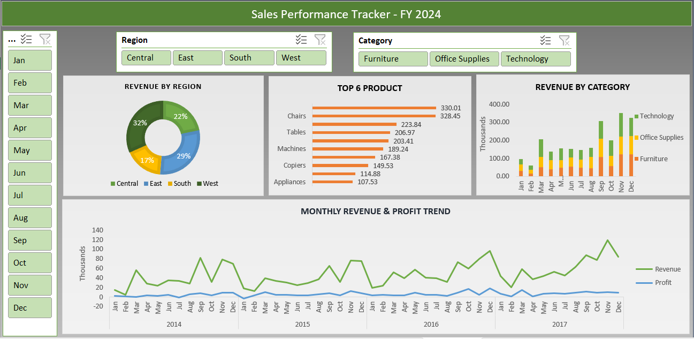

# 📊 Sales Performance Tracker (Advanced Excel Project)

<div align="center">
  
</div>

---

## 📊 Project Overview
This project involves a comprehensive analysis of sales data (Superstore Dataset) spanning from **2014 to 2017**. Using **Advanced Excel**, I processed **9,994 records** to uncover trends in revenue, profit margins, and regional performance. The goal was to create a dynamic system for business monitoring and data-driven decision-making.

### 🎯 Key Objectives:
* Analyze sales and profit across 3 product categories and 4 regions.
* Identify loss-making orders and discount patterns.
* Build an automated lookup system for orders and products.
* Create a dynamic dashboard with slicers for real-time filtering.

---

## 🛠️ Tech Stack & Excel Skills
* **Core Tool:** Microsoft Excel
* **Functions:** SUMIFS, COUNTIFS, VLOOKUP, INDEX-MATCH
* **Analysis:** Pivot Tables, Conditional Formatting, Power Query
* **Visuals:** Dynamic Charts (Line, Bar, Donut), Slicers, and Timelines

---

## 📈 Dashboard Preview


> *Note: Ensure the image file `sales_dashboard_image.PNG` is uploaded to your GitHub repository folder.*

---

## 🚀 Key Insights (FY 2014–2017)
| Metric | Value |
|---|---|
| 💰 Total Revenue | $2.29M |
| 📈 Total Profit | $286.40K (12.47% Margin) |
| 🏆 Best Performer | Technology — $836K revenue, 17.4% margin |
| ⚠️ Critical Issue | 1,871 loss-making orders (Furniture discounts) |
| 📅 Growth Trend | 51.4% revenue jump from 2014 to 2017 |
| 🗺️ Regional Leader | West region — $725K revenue |

---

## 💻 Analytical Methods Used
I implemented several advanced formulas to automate the analysis:

### 1. Dynamic Lookups
Used `VLOOKUP` and `INDEX-MATCH` to create a search interface where users can enter an **Order ID** or **Product ID** to instantly retrieve details like Customer Name, Category, and Profit.

### 2. Multi-Condition Aggregation
Used `SUMIFS` and `COUNTIFS` to calculate:
* Total Sales per Category.
* Count of orders exceeding $1,000 in revenue.
* Frequency of loss-making transactions.

---

## 📂 Project Structure

``` 
├── 📊 sales_performance_tracker.xlsx  # Main Excel File (Dashboard + Analysis)
├── 📝 sales_performance_report.pdf    # Detailed Project Report
├── 📄 sales_raw_data.csv              # Original Dataset
└── 📝 README.md                       # Project Documentation

``` 

---

## 💡 Recommendations
* **Discount Control:** Implement a "Discount Ceiling" for the Furniture category to fix the 2.5% low-profit margin.
* **Focus Area:** Double down on Technology products as they yield the highest ROI.
* **Regional Strategy:** Launch targeted marketing in the South region, which is currently the lowest revenue contributor ($391K).
* **Inventory:** Increase stock for "Large" and "High-Margin" items identified during the monthly trend analysis.

---

## 👤 Author

**Anuj Kumar Tiwari** — Aspiring Data Analyst

<p align="center">
  <a href="https://linkedin.com/in/anuj-kumar-tiwari-107704208">
    
  </a>
  <a href="mailto:anuujji@gmail.com">
    
  </a>
  <a href="https://github.com/Anuj-Kumar-Tiwari">
    
  </a>
</p>

---

<p align="center">
  ⭐ <b>If you find this Excel analysis useful, feel free to star the repository!</b>
</p>
